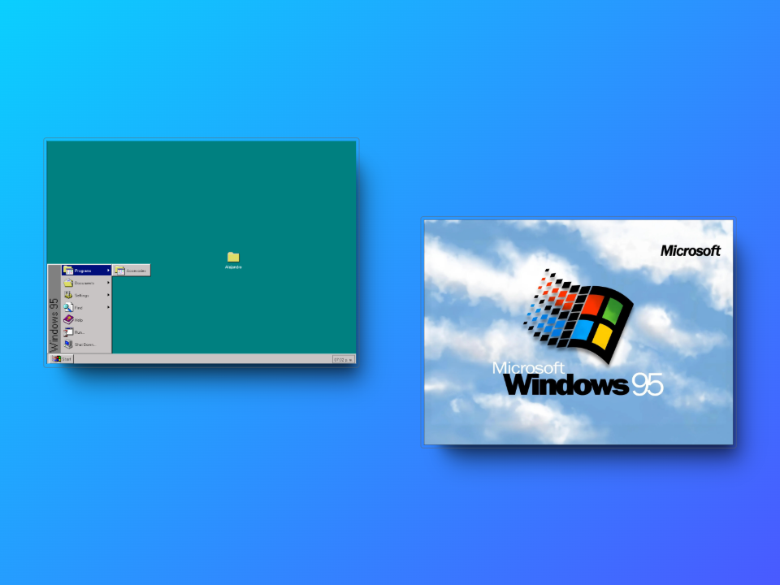
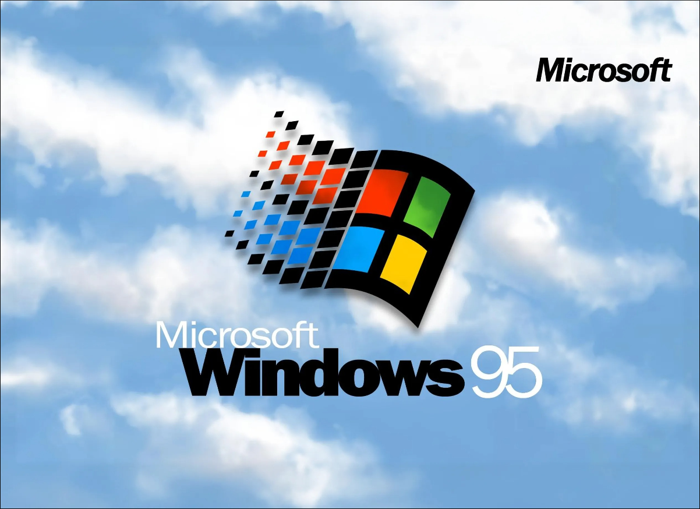
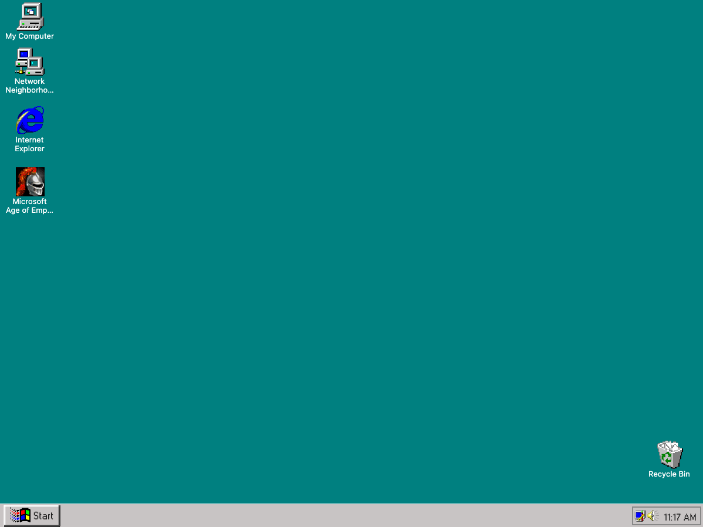
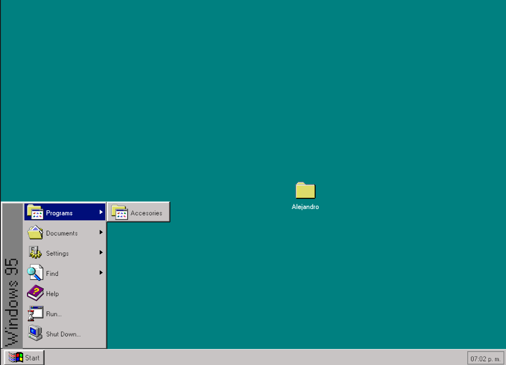

> [!NOTE]  
> 🌐 This README is also available in [English](README.en.md).

# Windows 95 - Kotlin Multiplatform

Este proyecto es una implementación con Kotlin Multiplatform (KMP) del icónico Windows 95. Combina prácticas modernas de desarrollo con una interfaz nostálgica.

<p align="center">
</center></a></p>

<p align="center">     </p>

----------

## 🛠 Instalación

### Requisitos

- **Kotlin 2.0.21+**
- **Compose Multiplatform 1.7.0+**
- **IDE compatible con KMP**: Fleet o Android Studio.
- Conocimientos básicos de Kotlin y KMP.

### Configuración

1. Clona este repositorio:

    ```bash
    git clone https://github.com/Alex3034/windows95.git
    ```
2. 
3. Abre el proyecto en Android Studio o Fleet.
4. Sincroniza el proyecto Gradle para descargar las dependencias.

## Imágenes del proyecto

|                       Pantalla de Inicio                        |
|:---------------------------------------------------------------:|
|  |

|                      Pantalla principal                       |
|:-------------------------------------------------------------:|
|  |

|                         Menú inferior                         |
|:-------------------------------------------------------------:|
|  |


----------

## ✏️ Estructura del proyecto

### Componentes

Puedes acceder a `ComposeApp/src/desktopMain/kotlin/com/alex/windows95/components` para acceder a todos los componentes. Se han programado lo más genéricos posibles para poder personalizarlos y reutilizarlos en cualquier lugar. Por ejemplo **WindowsButton**

```kotlin
WindowsButton(){
    Text("Ejemplo básico")
}

WindowsButton(Modifier.height(60.dp), onClick = {print("Example"}, dotPadding = 6.dp)){
    //Cualquier vista
}

```

### Helpers

Desde `ComposeApp/src/desktopMain/kotlin/com/alex/windows95/helper` dispones del `SoundManager`, el encargado de reproducir la música del splash.

### Extensions

En `ComposeApp/src/desktopMain/kotlin/com/alex/windows95/extensions` tendrás todas las funciones de extensión generadas para el proyecto.

```kotlin

Modifier.onRightClick {}

Modifier.clickableWithoutRipple {}

Modifier.rotateVertically()

//Entre otras

```

### Model

Todos los modelos de datos se encuentran en `ComposeApp/src/desktopMain/kotlin/com/alex/windows95/model`.

### Splash Screen

Primera vista del proyecto que se lanzará siempre que se ejecute la app. `ComposeApp/src/desktopMain/kotlin/com/alex/windows95/splash/SplashScreen.kt`.

### Windows 95

Vista principal del proyecto `ComposeApp/src/desktopMain/kotlin/com/alex/windows95/windows/Windows95Screen.kt`.

## 🌍 Plataformas Soportadas

- **Windows**
- **MacOS**
- **Linux**

----------

## 🤝 Contacto

Si tienes preguntas o sugerencias, no dudes en contactarme:
- **Email:** alejandrohm98a@gmail.com
- **GitHub:** [@Alex3034](https://github.com/Alex3034)

----------
¡Gracias por visitar este repositorio! Espero que encuentres útil este proyecto y te inspire en tus propios desarrollos.